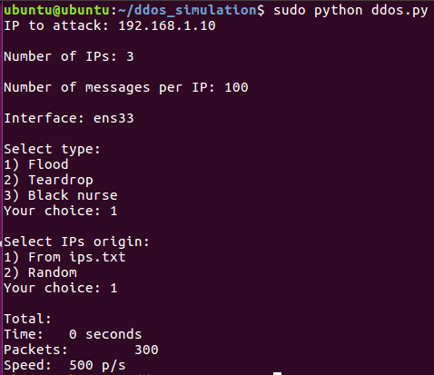

# ddos_generation_script

DDoS simulation written in Python using "scapy" and "multiprocessing" libraries

## Options:

There are 3 different DDoS attacks:

- Flood 

- Teardrop 

- Black nurse

You can set different options filling the "config.py" file:

- IP address

- Number of IPs

- Number of packets per IP

- Interface

- Type of attack

- Origin of IP addresses ("ips.txt" file or random addresses)

- Threads

## Example

